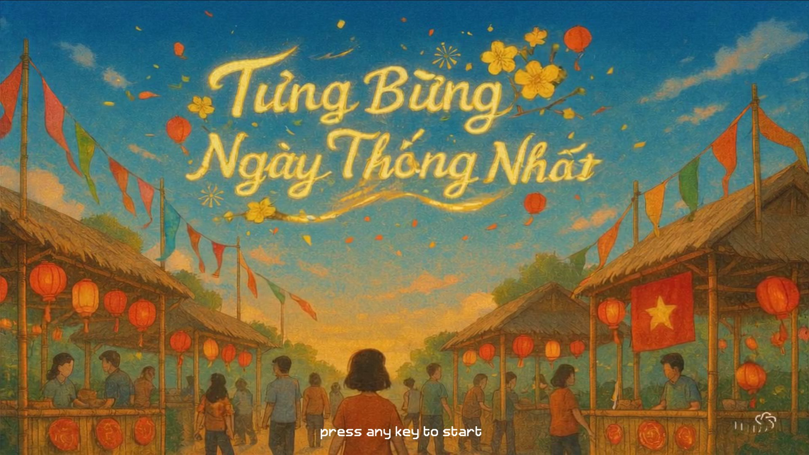
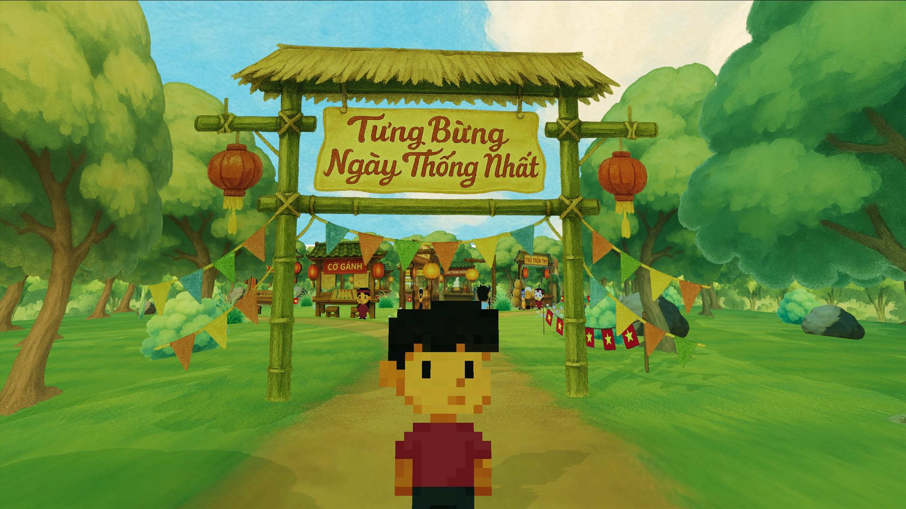
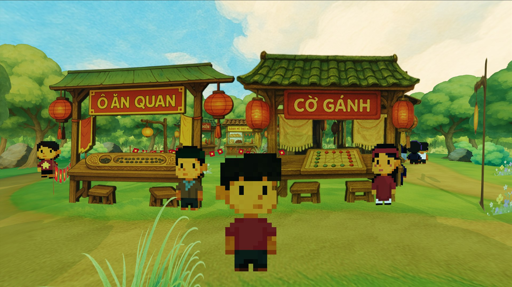
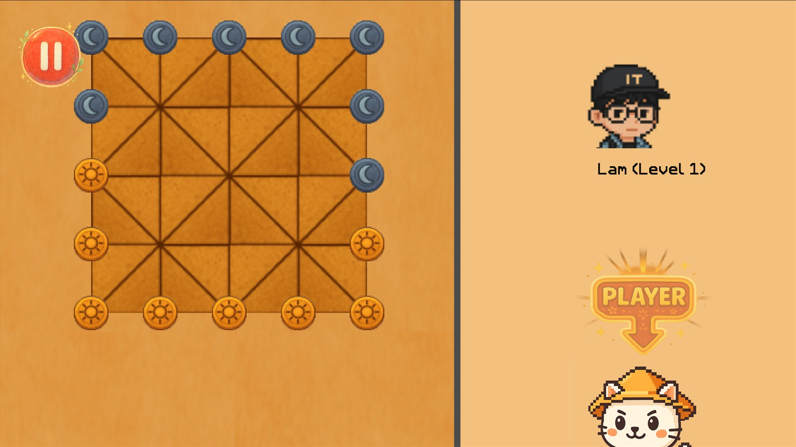
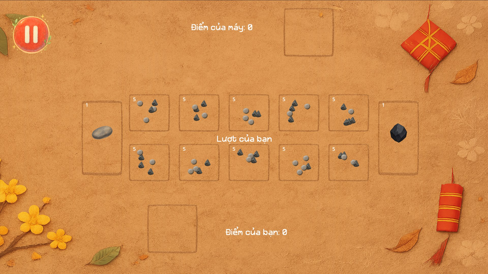
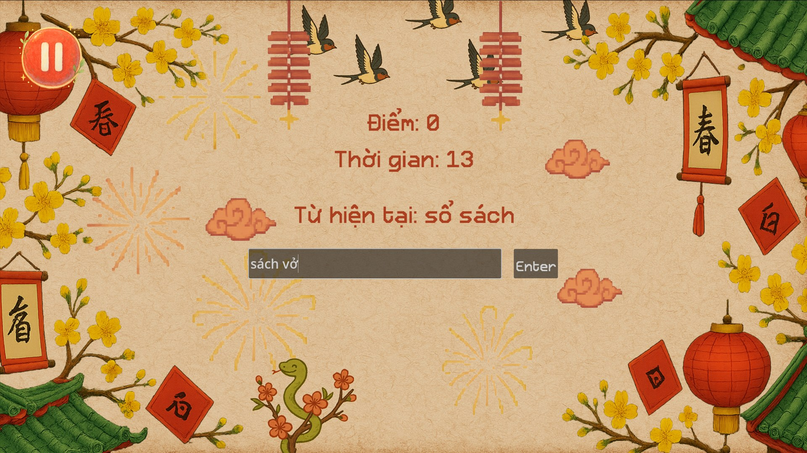
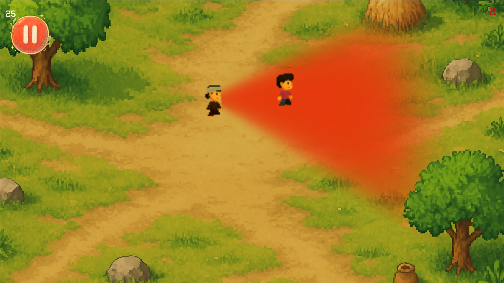

# Folk Games Collection

**Folk Games Collection** is a browser-playable Godot game that brings several Vietnamese folk-inspired mini-games into one shared festival hub.

Play now on itch.io: [https://hoangphann.itch.io/folk-games-collection](https://hoangphann.itch.io/folk-games-collection)



## About

Walk through a festival-style 3D hub, talk to characters, and launch different mini-games from the stalls. The collection mixes board-game strategy, word play, and stealth-style challenges in one project.

Included mini-games:

- **Co Ganh**: a Vietnamese strategy board game with bot difficulty selection.
- **Noi Chu**: a word-chain game backed by HTTP API responses.
- **O An Quan**: a traditional board game with difficulty-based AI.
- **Tron Tim**: a multi-level hide-and-seek / stealth challenge.

## Screenshots

<p align="center">
  
  
</p>

<p align="center">
  
  
</p>

<p align="center">
  
  
</p>

## Controls

- `WASD` or arrow keys: move
- `Shift`: run
- `E` or `Enter`: interact
- `Esc`: pause or close supported menus

## Run Locally

1. Install Godot `4.6` or a compatible `4.x` build.
2. Import `project.godot` from the repo root.
3. Wait for Godot to finish asset import.
4. Run the project with `F5`.

For setup details and troubleshooting, see [docs/import-and-run-godot.md](docs/import-and-run-godot.md).

## Backend Configuration

Some hub NPC dialogue and all of `NOI_CHU` depend on an HTTP backend.

Set the backend URL in Godot:

```text
Project Settings > application/config/backend_base_url
```

For deployed web builds, use an HTTPS backend URL and make sure the backend allows browser requests from the itch.io-hosted game.

## Export

The web export preset is configured in `export_presets.cfg`.

Typical release flow:

1. Set `application/config/backend_base_url` if API-dependent gameplay should work online.
2. Export preset `Web 2` to `EXPORT/index.html`.
3. Zip the contents of `EXPORT/` so `index.html` is at the root of the zip.
4. Upload the zip to itch.io as an HTML/browser game.

See [docs/refactors/refactor-verification.md](docs/refactors/refactor-verification.md) for the current export and verification notes.

## Repository Layout

- `MAIN/`: startup scene, hub world, player controller, dialogue systems, dialogue text files, and shared pause UI.
- `CO_GANH/`: Co Ganh board game module.
- `NOI_CHU/`: word-chain game module with HTTP backend dependency.
- `O_AN_QUAN/`: O An Quan board game with difficulty selection and AI settings.
- `TRON_TIM/`: multi-level stealth/avoidance module with unlock progression.
- `_SHARED ASSETS/`: shared font resources.
- `docs/`: architecture, contracts, runbooks, module docs, and refactor notes.
- `screenshots/`: README and itch.io page images.

## Documentation Map

Use [docs/architecture.md](docs/architecture.md) as the canonical runtime map, the contract docs as interface references, and [docs/runbooks/manual-smoke-test.md](docs/runbooks/manual-smoke-test.md) as the regression checklist.

- [docs/import-and-run-godot.md](docs/import-and-run-godot.md): import, run, and debug workflow.
- [docs/architecture.md](docs/architecture.md): scene flow, module boundaries, and autoload responsibilities.
- [docs/contracts/dialogue-and-scene-routing.md](docs/contracts/dialogue-and-scene-routing.md): dialogue file format and mini-game launch contract.
- [docs/contracts/external-api.md](docs/contracts/external-api.md): HTTP endpoints used by `MAIN` and `NOI_CHU`.
- [docs/refactors/technical-debt-refactor.md](docs/refactors/technical-debt-refactor.md): full description of the config, routing, API, module, and hygiene refactor.
- [docs/refactors/refactor-verification.md](docs/refactors/refactor-verification.md): focused verification checklist for the refactor.
- [docs/modules/MAIN.md](docs/modules/MAIN.md): module guide for the hub and shared UI.
- [docs/modules/CO_GANH.md](docs/modules/CO_GANH.md): module guide for Co Ganh.
- [docs/modules/NOI_CHU.md](docs/modules/NOI_CHU.md): module guide for Noi Chu.
- [docs/modules/O_AN_QUAN.md](docs/modules/O_AN_QUAN.md): module guide for O An Quan.
- [docs/modules/TRON_TIM.md](docs/modules/TRON_TIM.md): module guide for Tron Tim.
- [docs/repo-hygiene.md](docs/repo-hygiene.md): generated files, exports, and commit hygiene.

## Known Constraints

- The project has a validation script and manual smoke-test runbook, but no full automated gameplay test suite.
- `NOI_CHU` and dynamic NPC dialogue need a reachable backend for normal API-dependent play.
- Tron Tim progression is currently in-memory only and resets after restarting the app.
